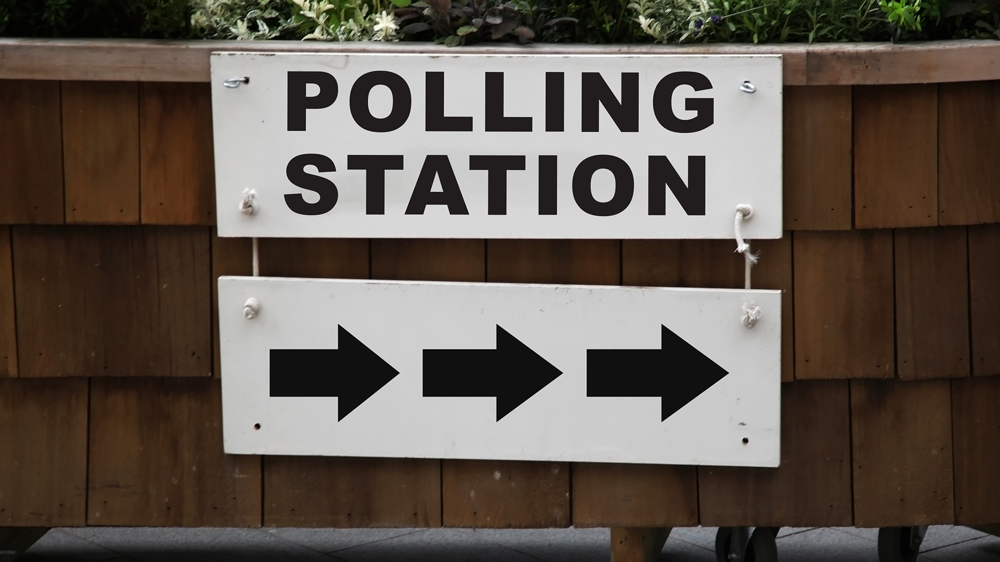

# Python_Challenge
## PyBank

* Create a Python script for analyzing the financial records of your company. Financial data to be analyzed is contained in the [budget_data.csv](PyBank/Resources/budget_data.csv). The dataset is composed of two columns: `Date` and `Profit/Losses`. (Thankfully, your company has rather lax standards for accounting so the records are simple.)

* Create a Python script that analyzes the records to calculate each of the following:

  * The total number of months included in the dataset

  * The net total amount of "Profit/Losses" over the entire period

  * Calculate the changes in "Profit/Losses" over the entire period, then find the average of those changes

  * The greatest increase in profits (date and amount) over the entire period

  * The greatest decrease in losses (date and amount) over the entire period

# Below is the financial analysis.

Financial Analysis 
-------------------- 
Total Months: 86
Total: $38382578
Average Change: $-2315.12
Greatest Increase in Profits: Mar-2012  ($1926159)
Greatest Decrease in Profits: Oct-2013  ($-2196167)

## PyPoll

* Help a small, rural town modernize its vote counting process.

* The poll data is called [election_data.csv](PyPoll/Resources/election_data.csv). The dataset is composed of three columns: `Voter ID`, `County`, and `Candidate`. Create a Python script that analyzes the votes and calculates each of the following:

  * The total number of votes cast

  * A complete list of candidates who received votes

  * The percentage of votes each candidate won

  * The total number of votes each candidate won

  * The winner of the election based on popular vote.

# Below are the results:

Election Results
---------------------------- 
Total Votes: 3521001
---------------------------- 
Khan:  63.000%%  (2218231)  
Correy:  20.000%%  (704200) < br/>
Li:  14.000%%  (492940)  
O'Tooley:  3.000%%  (105630)  
---------------------------- 
Winner:  Khan
---------------------------- 
